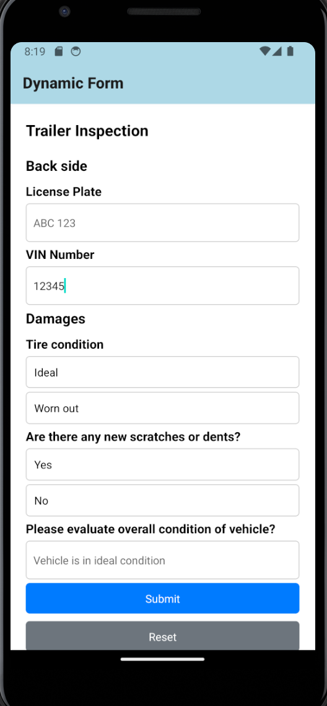

# Dynamic Form

A simple Dynamic Form based on json from API.


## How to use

You can use expo to run the project on your local machine. To do this, follow the steps below:

Install dependencies
```bash
npm install
```
Start the development server
```bash
npm start
```

## Sample API
The form is generated based on json from the API. You can use the following json as an example:
Sample API: https://dynamic-form.wiremockapi.cloud/api/v1
Update the API URL in the `.env` file.

Here is a sample json:

```JSON
{
  "name": "Trailer Inspection",
  "groups": [
    {
      "name": "Back side",
      "checkpoints": [
        {
          "type": "string",
          "name": "License Plate",
          "placeholder": "ABC 123"
        },
        {
          "type": "number",
          "name": "VIN Number",
          "placeholder": "1234567890"
        }
      ]
    },
    {
      "name": "Damages",
      "checkpoints": [
        {
          "type": "boolean",
          "name": "Tire condition",
          "values": ["Ideal", "Worn out"]
        },
        {
          "type": "boolean",
          "name": "Are there any new scratches or dents?",
          "values": ["Yes", "No"]
        },
        {
          "type": "string",
          "name": "Please evaluate overall condition of vehicle?",
          "placeholder": "Vehicle is in ideal condition"
        }
      ]
    }
  ]
}


```


## Screenshots



## TODO

- [x] API Call
- [x] Form Generation
- [ ] Form Validation
- [ ] Form Submission
- [ ] Performance
    - [ ] Lighthouse
    - [ ] Optimize code
- [ ] Documentation
    - [x] README.md
    - [x] Screenshots
    - [ ] Storybook
- [ ] Tests
    - [ ] Unit Test
    - [ ] E2E Test
    - [ ] Interactions by storybook
    - [ ] Accessibility
- [ ] CI/CD


## Feedback

Please submit an issue on GitHub if you have any feedback


## Contributing

Contributions are always welcome!

To contribute to this repository, please make a PR.


## Authors

- Mostafa Mirmousavi [@mirmousaviii](https://github.com/mirmousaviii) [https://mirmousavi.com](https://mirmousavi.com)


## License

[MIT](https://choosealicense.com/licenses/mit/)


## References

* https://reactjs.org/
* https://reactnative.dev/
* https://expo.dev/
* https://wiremock.cloud/